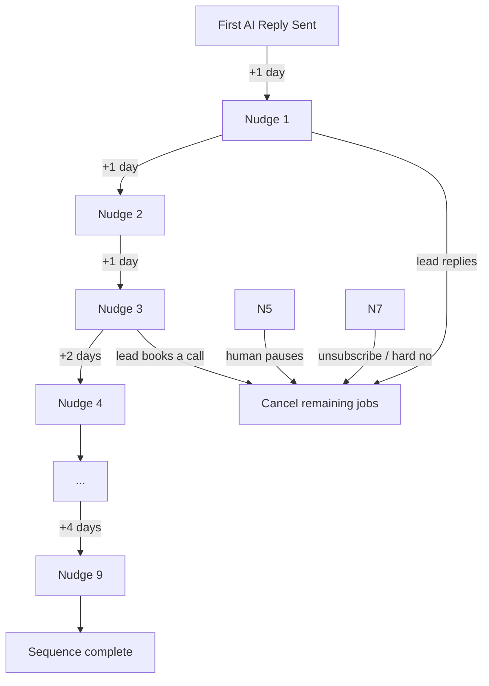

> This is Part 2. [Part 1 covers the core pipeline](../part-one): webhook ingestion, intent classification, the writer/reviewer loop, and the production bugs that followed going live.


After the core pipeline was stable, the obvious next problem: what happens when a lead doesn't reply?

The first AI reply goes out. It's good. The lead reads it and gets distracted. Two days pass. The window closes. Most sales pipelines die here not because of a bad reply, but because nobody followed up.

I built a nudge system. Then I built a control layer on top of it. Then I hit a wall of production bugs I didn't anticipate. Here's how all of it went.


## The Nudge System

The goal: after the AI sends its first reply, automatically follow up with up to 9 messages spaced over roughly three weeks, stopping the moment the lead responds.

Each nudge is a job in a BullMQ queue with a built-in delay. When nudge 1 fires, it sends, then queues nudge 2 with the next delay. Self-chaining. The sequence dies whenever a stop condition is hit.



The delay unit is configurable via an environment variable (`days`, `hours`, or `minutes`). Test locally on minutes, deploy on days.

### What makes a nudge stop

Two categories. Hard cancellation — jobs removed from the queue:

- Lead replies (any inbound after `firstReplySentAt`)
- Booking webhook fires (Calendly or equivalent)
- Human clicks "Pause AI" in Slack
- Sending platform classifies inbound as UNSUBSCRIBE, OOO, or SOFT_NO_DEAD

Soft skip — job fires but returns early without sending:

- `aiPaused = true` on the thread (set by any pause path)
- An inbound `replyLog` entry exists since `firstReplySentAt`

The second category matters because `nudgeQueue.remove()` only works on *waiting* jobs. A job that's already executing can't be cancelled from outside. The worker re-checks state at runtime. More on the race condition this creates later.

### Idempotency

The nudge worker uses job IDs: `nudge-{threadId}-{index}`. BullMQ deduplicates on job ID — if a nudge is already queued or running, adding it again is a no-op. Free idempotency, no extra logic needed.


## Context-Aware Nudges

The first version used static templates. Message 4 always said the same thing regardless of what had been discussed.

This breaks the moment there's been a real conversation. If the lead asked about pricing after nudge 2, nudge 3 fires with no awareness of that exchange. It looks like the AI forgot everything. Because it did.

The fix: generate each nudge body at send time, with the full thread history as context.

The nudge worker already had to call the sending platform's thread API to resolve the correct `reply_to` ID. I reused that response to extract the message history, then passed it to a new `nudge-writer` agent:

```ts
// Fetch thread history (already needed for reply-to resolution)
const threadData = await getThread(replyToId)
const older = threadData?.data?.older_messages ?? []
const threadHistory = older
  .map(m => `[${m.folder === "Sent" ? "Us" : "Them"} — ${m.date_received}]\n${m.text_body}`)
  .join("\n\n---\n\n")

// Generate nudge body from context + stage
body = await generateNudgeBody({
  threadHistory,
  nudgeIndex,
  leadFirstName,
  leadCompany,
  fallbackText, // static template used if AI call fails
})
```

The `nudgeIndex` determines the tone posture — early nudges are light check-ins, later ones have soft urgency, the final one is a clean close. The AI handles the actual words, informed by what's already been discussed.

The static templates stay as fallback. If the AI call fails, the nudge still sends.


## The Stale Reply ID Problem

Nudges send as thread replies, not new emails. To stay in-thread, the worker needs the ID of the last sent message to use as `reply_to`.

This worked fine when the AI was the only one sending. It broke when a human replied manually from their inbox. The stored `lastOutboundReplyId` still pointed to the previous AI message. The next nudge chained off that — forking the thread from the lead's perspective.

The fix: resolve the freshest sent message at send time, not from the DB.

```ts
export async function getLatestSentReplyId(replyId: string): Promise<string | null> {
  const res = await fetchWithTimeout(
    `${BASE_URL}/replies/${replyId}/conversation-thread`,
    { headers }
  )
  if (!res.ok) return null
  const json = await res.json()
  const sent = (json.data?.older_messages ?? [])
    .filter(m => m.folder === "Sent")
    .sort((a, b) => new Date(b.date_received).getTime() - new Date(a.date_received).getTime())
  return sent.length > 0 ? String(sent[0].id) : null
}
```

Called at the start of every nudge execution. Falls back to the stored ID if the lookup fails.


## The Race Condition

The nudge worker checks for inbound replies at the start of execution. If the lead has replied, it stops. If not, it builds the message and calls the send API.

The problem: that check and the API call are not atomic. There's a window — however long it takes to generate the AI body and make the HTTP call — where the lead's reply could arrive. The nudge fires after the lead has already responded.

The fix: check again immediately before the API call.

```ts
// First check — broad guard, runs early
if (await inboundCheck()) return

// ... build nudge body (AI call, ~1-2 seconds) ...

// Second check — tight guard, right before send
if (await inboundCheck()) {
  console.log(`[Nudge] Race condition caught — aborting send`)
  return
}

await sendReply(...)
```

This doesn't eliminate the window. Nothing short of distributed transactions would. But it reduces it from seconds to milliseconds, which is acceptable at this scale.


## The Slack Control Layer

The system needed a way for a human operator to control the AI without touching code or a dashboard. The operator is already in Slack. Every AI action already posts there. The control surface should live there too.

### Pause — already existed

Every AI reply and nudge includes a "Pause AI for this lead" button. Clicking it cancels all queued nudge jobs for that thread and sets `aiPaused = true`.

### Resume — didn't exist

Pausing is useless without a way back. After a thread is paused, a "Resume AI" button posts in the same Slack thread. Clicking it clears `aiPaused`, looks up `nudgeIndex`, and re-queues the next nudge with the correct delay for that position in the sequence.

```ts
const nextIndex = (thread.nudgeIndex ?? 0) + 1
const nudgeDelay = NUDGES[nextIndex - 1]?.delayDays ?? 1

await nudgeQueue.add("nudge", { ...params, nudgeIndex: nextIndex }, {
  delay: nudgeDelayMs(nudgeDelay),
  jobId: `nudge-${thread.emailbisonThreadId}-${nextIndex}`,
})
```

One detail worth calling out: `NUDGES[nextIndex - 1].delayDays`, not a hardcoded `1`. Later nudges have 2-3 day gaps. Using `1` for all resumes would compress them incorrectly.

### Draft review

The writer/reviewer loop occasionally produces a draft scoring 60-79 — below the auto-send threshold but above the "human writes from scratch" floor. Previously this flagged in the CRM. The operator might see it. They might not.

Now it posts directly to Slack with the draft visible and two buttons: "Send this" and "Decline — I'll write it."

The draft body is stored in Redis with a 30-minute TTL. The Slack button value holds the Redis key. Slack has a 2000-character limit on button values; the draft body easily exceeds that.

```ts
const draftKey = `draft:${replyId}`
await redis.set(draftKey, JSON.stringify({ body, replyId, threadId, ... }), "EX", 1800)

// Button value: just the key
{ action_id: "send_draft", value: draftKey }
```

When the operator clicks "Send this", the handler retrieves the draft from Redis and calls `executeSendReply` directly. When they click "Decline", a "I sent it manually — start nudges" button posts, pre-populated with thread context. Declining also writes a `declined` entry to `replyLog` so the idempotency guard doesn't block a future retry.

### When a human replies manually

If the operator edits the AI draft and sends it from their own inbox, `firstReplySentAt` never gets set. Nudges never fire.

The "I sent it manually — start nudges" button handles this. The operator clicks it after sending. The handler calls `getLatestSentReplyId` to find the sent message, sets `firstReplySentAt` and `lastOutboundReplyId`, and queues nudge 1.


## Production Bugs

### The Slack 401

An operator clicked "Pause AI." Got a 401 error in the Slack action. The pause did not go through.

The Slack interactions endpoint verifies requests using HMAC-SHA256 over the raw request body. Fastify's `@fastify/formbody` plugin parses the body before the handler runs. By the time the handler executes, the raw bytes are gone. `JSON.stringify(request.body)` produces a different string than what Slack signed — different key ordering, different encoding — so the HMAC never matched.

The fix: `fastify-raw-body` plugin with `global: false`. The interactions route opts in with `{ config: { rawBody: true } }`. The plugin captures the raw bytes before parsing.

Note: `fastify-raw-body` v5 requires Fastify v5. If you're on v4, install `fastify-raw-body@4`.

While fixing this, I added timestamp validation. Slack's security guide requires rejecting requests where the timestamp is more than 5 minutes old, to prevent replay attacks. Cheap to add.

```ts
if (Math.abs(Date.now() / 1000 - parseInt(timestamp)) > 300) {
  return reply.status(401).send({ error: "stale timestamp" })
}
```

### A mass email that got an AI reply

An inbound arrived from a lead in the sending platform. The AI classified it as interested and sent a reply. The "email" was a mass newsletter blast — not a reply to our outreach at all.

What happened: the sender was already a lead in the platform from a previous import. The platform matched their newsletter to their tracked thread and fired `LEAD_REPLIED`. Our system had no way to know the difference.

The sending platform's webhook payload includes an `automated_reply` boolean. I was discarding it in the normalization layer. A newsletter blast with an unsubscribe footer comes through with `automated_reply: true`.

Fix: preserve the field through normalization and guard on it early.

```ts
if (payload.reply.automated_reply === true) {
  console.log(`[Worker] Skipping — automated reply from ${payload.lead.email}`)
  return
}
```

This doesn't catch every edge case. But it handles the obvious one.

### The enrollment script that fired nudges prematurely

I wrote a one-off script to enroll existing leads into the nudge pipeline — leads who had replied before the system existed and never received follow-ups. The script fetched their reply history, created DB records, and queued nudge 1.

Two problems.

One: I enrolled a lead whose thread was already being handled manually. A nudge fired into an active conversation. The operator had to explain to a prospect why they were receiving a generic follow-up in the middle of a real exchange.

Two: I enrolled a lead who had replied with an unanswered question. Nudge 1 fired before I could stop it. It read like the AI had ignored the question entirely. Because from the AI's perspective, the question had never existed.

The cancel script ran quickly. The damage was already done.

**Lesson:** Enrollment scripts are irreversible from the lead's perspective. A nudge that fires cannot be unsent. Any thread where a human is actively involved should be excluded before running. Review every row, not just the code.

### The idempotency guard that blocked multi-turn

The original send-reply idempotency guard checked for any outbound `replyLog` entry on the thread:

```ts
const existing = await db.query.replyLog.findFirst({
  where: (r, { and, eq }) => and(
    eq(r.threadId, thread.id),
    eq(r.direction, "outbound")
  ),
})
if (existing) return // blocks all future AI replies on this thread
```

Correct for preventing duplicate sends on retry. Wrong for multi-turn: the second time a lead replied, the AI tried to respond, hit this guard, and silently dropped the job. No notification. No CRM note. Nothing.

The guard was too broad. The real constraint is: don't send twice *for the same inbound reply*. Two different replies should produce two different outbound messages.

Fix: add an `inbound_reply_id` column to `replyLog`, scope the guard to the specific inbound that triggered the send.

```ts
const existing = await db.query.replyLog.findFirst({
  where: (r, { and, eq }) => and(
    eq(r.threadId, thread.id),
    eq(r.direction, "outbound"),
    eq(r.inboundReplyId, data.replyId) // scoped to this inbound
  ),
})
```

Retries are still idempotent — same `replyId` hits the guard. Second replies on the same thread now produce second outbound messages.


## What I'd Do Differently

**Audit the data, not just the code.** The enrollment script was correct. The data it ran against wasn't. Edge cases were visible before running. Running anyway cost a real prospect interaction.

**End-to-end test Slack interaction endpoints before they're needed in a crisis.** The Pause AI button existed for weeks before it mattered. When it mattered — a nudge actively firing on the wrong thread — it 401'd. The signature check had never been tested with a real Slack payload.

**Log everything the normalization layer discards.** The `automated_reply` field was in the raw webhook payload. I dropped it. When a newsletter got an AI reply, I had no record the field had existed or what value it carried. I only found it by re-reading the API docs afterward.

---

## More Edge Cases

Shipping the nudge system and Slack controls surfaced a second wave of edge cases. Some were obvious in hindsight. Some required production incidents to discover.

### Lead replies mid-sequence with a question

The original routing logic: if `firstReplySentAt` is set → cancel pending nudges → route to Tom, done. The nudges stop permanently.

The actual desired behavior: the AI should answer the question, then resume nudges from the current position in the sequence — not restart from 1, not skip ahead.

The gap was in the reply classifier. Any inbound with `firstReplySentAt` already set was immediately routed to human review, even if the intent was QUESTION and the confidence was high. The fix is a new routing branch: QUESTION or POSITIVE with `firstReplySentAt` set calls `writeAndSend` with the full thread history in context, then re-queues from `nudgeIndex` after a successful send.

### Meeting no-show

The booking webhook fires → `aiPaused = true`. From the system's perspective, this lead is handled. If the meeting happens and the lead ghosts it, the thread stays paused forever. No re-engagement path exists.

The fix requires a post-meeting hook from the calendar provider — or a scheduled job that checks for threads paused longer than N days after the last booking event and posts a Slack alert asking the operator to either resume or close. This remains partially manual.

### Tom pauses, forgets to unpause

The Resume AI button handles this (see Slack control layer above), but the sequence position matters. The button re-queues from `nudgeIndex + 1` with that nudge's actual delay, not a hardcoded 1 day. Using the sequence-defined delay is critical — later nudges have 2–4 day gaps, and compressing them looks like spam.

### Cold lead re-engages months later

A lead who went fully cold — all 9 nudges fired, or sequence was cancelled — sends a new email weeks later. The reply worker runs. `firstReplySentAt` is already set → routes to Tom.

This is the right default for cold re-engagements. The conversation context is stale, the lead's situation may have changed, and routing to a human for the first message back is correct. What's missing is the automation *after* Tom responds: a way to manually trigger a fresh nudge sequence from nudge 1, with a new `firstReplySentAt`.

### Nudge content after a real conversation

This one is partially solved by context-aware nudge generation. But there's a subtler version: if the lead asked a specific question and got a specific answer, nudge N+1 shouldn't be a generic check-in. The nudge writer needs enough context from the thread to make the follow-up feel like a continuation, not a reset.

The prompt includes full thread history, and the `nudgeIndex` signals the tone posture. In practice this works most of the time. It still fails when the thread contains ambiguous back-and-forth that the model can't cleanly summarize into a nudge angle.


## Making the Agent Multi-Turn

The infrastructure for multi-turn was unblocked once the idempotency guard was scoped correctly and thread history was available at send time. The routing logic was the remaining piece.

### What needed to change

Four things:

**1. Reply classifier routing.** The classifier already produced QUESTION, POSITIVE, SOFT_NO, etc. The issue was the branch that handled `firstReplySentAt`. Before: any inbound with `firstReplySentAt` set → human review. After: QUESTION or POSITIVE with `firstReplySentAt` set → `writeAndSendFollowUp`, which runs the same writer/reviewer loop but with the full thread injected as context.

Some intents still always route to Tom regardless of turn count: REFERRAL, PRICING_PUSHBACK (above a certain signal strength), and anything scoring below the confidence threshold. The AI shouldn't handle complex negotiation in multi-turn.

**2. Thread history as context.** The single-turn agent received only the lead's inbound message. The multi-turn agent receives a formatted version of the full thread — all prior messages, labeled by sender, in chronological order:

```ts
const threadHistory = olderMessages
  .map(m => `[${m.folder === "Sent" ? "Us" : "Them"} — ${m.date_received}]\n${m.text_body}`)
  .join("\n\n---\n\n")
```

This gets injected into the writer prompt as a `<conversation_history>` block. The reviewer prompt also sees it, so the review criteria accounts for consistency with what was already said.

**3. Nudge resume after AI re-reply.** After a successful multi-turn send, the handler re-queues the nudge sequence from `nudgeIndex` — not from 0. The first two nudges in the resumed sequence are short check-ins, then the sequence continues from its current position. Restarting from 1 after every AI re-reply would produce a meaningless nudge count and compress the spacing incorrectly.

**4. Guardrails on loop depth.** Nothing currently prevents a lead from engaging in an extended multi-turn exchange. The system routes up to a `maxAiTurns` threshold per thread — after which it routes to human review with a summary of the AI-handled turns. This prevents the AI from handling increasingly complex objections without any human awareness.

### What it looks like end to end

```
Lead inbound (turn 1) → classify → write → review → send → nudge sequence starts
Lead follow-up (turn 2) → classify → thread history fetched → write → review → send → nudge sequence resumes from position
Lead follow-up (turn 3) → same path
Turn N > maxAiTurns → route to Tom with thread summary
```

The Slack notification for multi-turn sends includes a "turn N of maxAiTurns" label, so the operator can see how deep the AI is into a thread without opening the CRM.


## What's Next

The immediate gaps are the ones that still touch human review:

- Cold re-engagement automation: a manual trigger from Slack to restart a nudge sequence for a lead Tom has re-engaged with
- Post-meeting re-engagement: detect a no-show and route back into the sequence instead of staying paused indefinitely
- `maxAiTurns` tuning: the current threshold is conservative; calibrating it against real thread data to find where AI reply quality starts degrading

The pipeline now handles the full surface area of a reasonably complex outbound sequence. The remaining work is reducing the manual touchpoints that exist as escape valves.
