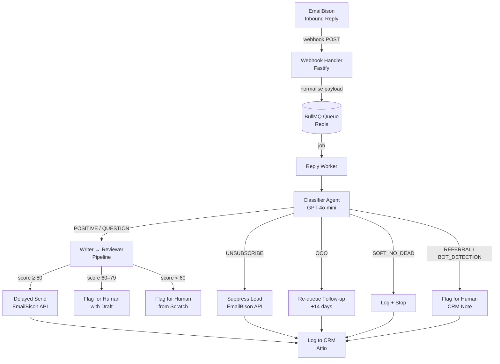
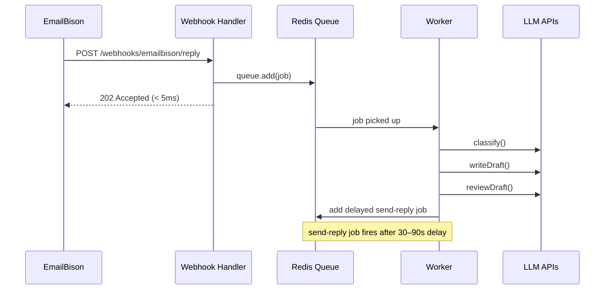
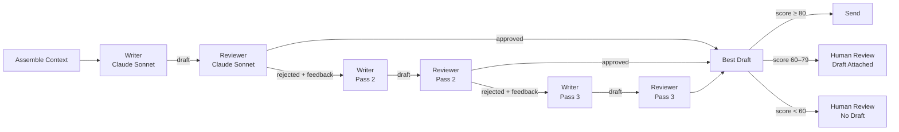

> Stack: TypeScript, Node.js, OpenAI, Anthropic (Claude), BullMQ, Redis, PostgreSQL, Drizzle ORM
> This is a real system running in production. Not a toy demo.

---

I built an autonomous email reply agent that reads inbound replies to cold outreach campaigns, classifies the intent, drafts a reply, has another model review the draft, and sends it. All without a human in the loop.

Here's exactly how it works.


## The Problem

Cold outreach at scale generates a lot of inbound replies. Most of them fall into predictable buckets: someone's interested and wants to book a call, someone has a question, someone's out of office, someone wants to unsubscribe.

Handling each of these manually is a bottleneck. The replies come in at all hours, the window to respond is narrow, and the responses themselves follow consistent patterns.

This is exactly the kind of problem multi-agent systems are built for.


## The Architecture

The system has three layers:

1. **Ingestion** - a webhook receives the inbound reply, normalises the payload, and drops a job into a Redis queue
2. **Processing** - a worker picks up the job, classifies the intent, then routes it
3. **Action** - depending on intent, it either drafts and sends a reply, suppresses the lead, re-queues a follow-up, or flags for human review



Every path ends in a CRM note. Nothing gets lost.


## The Webhook Normalisation Layer

The first thing I had to solve: the real webhook payload from EmailBison looks nothing like what I assumed when I started building.

The actual payload is a nested envelope:

```json
{
  "event": { "type": "LEAD_REPLIED", ... },
  "data": {
    "reply": { "text_body": "...", "date_received": "..." },
    "lead": { "id": 1, "email": "...", ... },
    "sender_email": { "email": "...", "name": "..." },
    "scheduled_email": { "id": 4, "sequence_step_id": 2, ... },
    "campaign": { "id": 2 }
  }
}
```

Field names, nesting, types: all different from what the docs implied. `text_body` not `body_text`. `date_received` not `received_at`. Lead ID is a number, not a string. No `thread_id` anywhere. I use `scheduled_email.id` as the thread identifier for subsequent API calls.

Rather than update every handler to deal with this, I wrote a single normalisation function:

```ts
export function normalizeWebhookPayload(
  raw: RawEmailBisonWebhookPayload
): EmailBisonWebhookPayload {
  return {
    event: raw.event.type as "LEAD_REPLIED" | "LEAD_INTERESTED",
    thread_id: String(raw.data.scheduled_email.id),
    lead: {
      id: String(raw.data.lead.id),
      email: raw.data.lead.email,
      // ...
    },
    reply: {
      body_text: raw.data.reply.text_body,
      body_html: raw.data.reply.html_body,
      received_at: raw.data.reply.date_received,
      // ...
    },
  }
}
```

One transformation at the boundary. Everything downstream works with the clean internal type. If EmailBison changes their payload shape again, there's exactly one place to update.


## The Queue

The webhook handler does almost nothing. It validates the signature, normalises the payload, drops the job, and returns 202. Done in under 5ms.

```ts
app.post("/webhooks/emailbison/reply", async (request, reply) => {
  // validate signature...
  const payload = normalizeWebhookPayload(request.body)
  await replyQueue.add("process-reply", { payload }, {
    jobId: `reply-${payload.thread_id}-${Date.now()}`,
  })
  return reply.status(202).send({ queued: true })
})
```

The heavy work happens in the worker, asynchronously. This matters because the writer/reviewer pipeline makes multiple LLM calls, and that takes seconds, sometimes longer. You cannot do that synchronously in a webhook handler.

BullMQ gives you durability (jobs survive restarts), retries (3 attempts with exponential backoff), and concurrency control (5 parallel workers).




## The Classifier

The classifier is the gatekeeper. It reads the raw email body and outputs one of eight intent buckets:

| Bucket | Action |
|---|---|
| `POSITIVE` | Draft and send reply |
| `QUESTION` | Draft and send reply |
| `SOFT_NO_NURTURE` | Flag for human |
| `SOFT_NO_DEAD` | Log and stop all comms |
| `UNSUBSCRIBE` | Suppress immediately (legal requirement) |
| `OOO` | Re-queue follow-up 14 days out |
| `REFERRAL` | Flag for human (never auto-contact third parties) |
| `BOT_DETECTION` | Flag for human (never auto-reply to "is this AI?") |

It runs on GPT-4o-mini. Fast, cheap, and good enough for classification. You don't need a frontier model to decide if someone said "remove me."

```ts
const ClassificationSchema = z.object({
  intent: z.enum([
    "POSITIVE", "QUESTION", "SOFT_NO_NURTURE", "SOFT_NO_DEAD",
    "UNSUBSCRIBE", "OOO", "REFERRAL", "BOT_DETECTION"
  ]),
  confidence: z.number().min(0).max(1),
  reasoning: z.string(),
})
```

The output is always structured. If the model hallucinates a field, Zod throws immediately.


## The Writer → Reviewer Loop

For intents that need a reply (`POSITIVE`, `QUESTION`), the job enters the writer/reviewer pipeline.



The Writer drafts the reply. The Reviewer scores it on multiple dimensions (tone, CTA clarity, length, persona fit) and either approves it or returns structured feedback. If rejected, the Writer gets the feedback and tries again. Maximum 3 passes.

The system tracks the best draft across all passes, not just the last one. Pass 3 isn't always better than Pass 2.

The Reviewer produces a composite score (0-100). Above 80: auto-send. 60-79: surface to human with the draft attached. Below 60: human writes from scratch.


## The Humanisation Delay

Sending a reply 3 seconds after receiving an email is obviously automated. The system adds a random 30-90 second delay before sending. Enough to feel human, short enough to stay within a 2-minute response window.

The naive implementation would be:

```ts
// DO NOT do this
await new Promise(resolve => setTimeout(resolve, delayMs))
await sendReply(...)
```

That holds the BullMQ worker slot for up to 90 seconds. With 5 concurrent workers, you'd exhaust the pool fast.

The correct approach: enqueue a second job with BullMQ's built-in delay.

```ts
// In the writer/reviewer handler, after approval:
await sendReplyQueue.add("send-reply", jobData, { delay: randomSendDelayMs() })

// Separate minimal worker just handles the actual send:
const sendReplyWorker = new Worker("send-reply", async (job) => {
  await executeSendReply(job.data)
})
```

Job 1 (writer/reviewer) completes immediately and frees the worker. Job 2 (send) wakes up after the delay and does the actual send. Two jobs, clean separation, no blocked workers.


## The Integration Layer

Two external integrations: EmailBison (the sending platform) and Attio (the CRM).

**EmailBison** handles four operations:

```ts
suppressLead(leadId)                        // UNSUBSCRIBE - stop all sequences
requeueFollowUp(threadId, delayDays)        // OOO - reschedule 14 days out
sendReply({ threadId, body, ccEmail })      // send the actual reply
```

**Attio** handles two operations:

```ts
logClassifiedReply(params)   // creates a note on the person record
flagForTom(params)           // creates an urgent note for human review
markUnsubscribed(leadEmail)  // updates an attribute on the person record
```

The tricky part with Attio: the Notes API requires a record UUID as `parent_record_id`. It doesn't accept an email address directly. So every Attio call first does a lookup:

```ts
async function findPersonByEmail(email: string): Promise<string> {
  const res = await fetch(`${BASE_URL}/objects/people/records/query`, {
    method: "POST",
    body: JSON.stringify({
      filter: { email_addresses: { "$eq": email } },
      limit: 1,
    }),
  })
  const json = await res.json()
  return json.data[0].id.record_id
}
```

One extra API call per operation. Acceptable for an async background job.


## After Going Live

I pushed to production and turned the webhook on. Here is what actually happened.


### The identifier problem

EmailBison has two identifiers for a reply: a numeric `id` and a `uuid`. The webhook gives you both. The CRM Slack notification (posted by a Zapier automation) embeds the UUID in a URL. The send API uses the numeric ID. The thread history API uses the numeric ID. The Slack search logic I wrote was searching for the UUID while the code was passing the numeric ID.

Everything looked fine in local tests because I never had a real Slack message to search against.

In production, the Slack reaction fired but couldn't find the message, and silently skipped. I only noticed when I watched the Slack channel and saw no reaction appear.

Fix: stop searching by ID entirely. The Slack message always contains the lead's email address. Search by email. More reliable, survives any ID format change.


### The Attio person creation errors

Three separate issues creating a person record in Attio.

First: `primary_location`. I assumed this was a website field. It's a physical address field. Posted a domain URL, got a 400. Removed the field.

Second: `name` requires `full_name` in addition to `first_name` and `last_name`. Not obvious from the schema. Got a 400 until I added it.

Third: the Notes API scope is separate from the read/write scope. My API key didn't have it. Every note operation returned 403 for two hours before I realised. Added the scope in Attio settings.

None of these errors were fatal to the pipeline. I had wrapped Attio calls in try/catch, but they were all silently failing. The CRM notes weren't being created. The leads weren't being logged anywhere except the console.

**Lesson:** Wrap third-party API calls in try/catch. But also log the failures clearly. Silent recovery masks real problems.


### Two events, one reply

EmailBison fires both `LEAD_REPLIED` and `LEAD_INTERESTED` for the same inbound email. They hit the webhook within milliseconds of each other.

My job deduplication is `jobId: reply-${reply.id}`. BullMQ deduplicates on job ID: if the first job hasn't completed yet, the second one with the same ID is dropped. So in most cases, this worked fine.

But during one test, both events had different reply IDs (the system had processed one of them as a new thread). Both jobs ran concurrently. Both saw `attioRecordId = null`. Both called `addToPipeline`. Duplicate deal in Attio.

Fixed with a two-layer guard: check the DB before calling Attio, and check Attio before creating the deal. Either check failing is enough to prevent the duplicate.


### `firstReplySentAt` was set too early

After the writer/reviewer pipeline approved a draft, I set `firstReplySentAt` immediately, before the actual send job ran. The intent was to prevent duplicate AI replies on concurrent events.

The problem: the actual send happens in a separate delayed worker, 30-90 seconds later. If EmailBison was down during that window and all three retry attempts failed, the thread would be permanently marked as replied. The lead never received the email. No alert. No recovery path.

Fixed by moving `firstReplySentAt` into `executeSendReply`, set only after `sendReply()` returns successfully.


### The retry duplication problem

The send-reply worker has three retry attempts. If the send succeeded but the Slack reaction step threw, BullMQ retried the whole job, including the send. The lead got the same email twice.

The fix: an idempotency check at the top of `executeSendReply`. Before calling the send API, look for an existing outbound `replyLog` entry for this thread. If one exists, skip and return. The retry becomes a no-op.

```ts
const existing = await db.query.replyLog.findFirst({
  where: (r, { and, eq }) =>
    and(eq(r.threadId, thread.id), eq(r.direction, "outbound")),
})
if (existing) {
  console.log(`Skipping duplicate send - already sent`)
  return
}
```

This also means the steps after the send (Slack, Attio, DB log) are each wrapped in their own try/catch. A failure in any of them doesn't cause the job to fail and retry the send.


### Second replies were silently dropped

A lead who already got an AI reply would sometimes reply again. The first reply had set `firstReplySentAt`. When the second reply came in, the system hit the guard, logged "already replied," and dropped the job.

No Tom notification. No Attio note. Nothing.

Fixed: when `firstReplySentAt` is set on a thread, route to Tom instead of dropping. Second replies are follow-ups. They need a human.


### Emails were being sent as plain text

The first real reply that went out had raw URLs in it, not hyperlinks. The HTML conversion was happening, but the URL regex I wrote excluded `.` from the URL character class, which broke every domain name.

```ts
// broken - excludes dots from URLs
/(https?:\/\/[^\s.]+)/g

// fixed - match full URL, trim trailing punctuation after
/(https?:\/\/[^\s]+)/g
// then:
const trimmed = url.replace(/[.,;:!?)]+$/, "")
```

The fix is to match the whole URL greedily, then trim trailing punctuation as a second step. The regex doesn't try to be smart about where the URL ends. It just trims known trailing punctuation characters.

A second issue: UTM parameters in links made the display text ugly. Added a cleanup pass for display text: keep the UTM params in the `href`, strip them from the visible text.


### The classifier needs a confidence floor

The classifier returns a confidence score. I was ignoring it.

An UNSUBSCRIBE classified at 55% confidence got treated the same as one at 99%. A borderline soft-no email that the model was unsure about got suppressed.

Added a threshold: below 70% confidence, route to Tom regardless of the classified intent. The model is uncertain, so a human should decide.


### An intent bucket I hadn't planned for

A real reply came in: "Hi Alex, I'm not the right person for this. I've CC'd the right contacts. I understand they're interested in a demo."

My classifier put it in `REFERRAL`. The handler routed it to Tom with no reply sent.

That's wrong. The CC'd contacts were already on the thread. `reply_all: true` means a reply from us goes to all of them. This is a warm handoff. The right move is a short reply thanking the sender and welcoming the team, with a booking link.

Updated the classifier to treat confirmed-interested referrals as `POSITIVE`, added a writer rule for the intro pattern, added a training example. The next time this came in, the agent handled it correctly.


### Em dashes

The drafts coming out of the writer looked good on first read. But reading them out loud, something felt slightly off.

Em dashes. The model loves them. `We built this — specifically for your use case`. `Fast, cheap — and it works`.

Real founders don't write like that. Added a hard rule to the writer prompt: no em dashes. Use a regular hyphen or restructure the sentence. Added a corresponding penalty to the reviewer. The drafts sound more human now.


### What I'd do differently

**Design for retry idempotency from the start.** Every external call in a retryable job should be safe to call twice. Log the result before calling. Check the log before retrying. This is not optional.

**The confidence score is part of the output.** If you're ignoring it, you're throwing away information the model is telling you about its own certainty. Use it.


## What's Next

- Wire up real Attio credentials and verify the `findPersonByEmail` filter works against a real workspace
- Parameterise the sender persona (Calendly link, video URL, sign-off) - currently hardcoded
- Add the `SOFT_NO_NURTURE` writer path (currently routes to human)
- Structured logging with Langfuse for observability across LLM calls

The core pipeline (webhook -> queue -> classify -> write -> review -> send) is working end to end. Everything else is iteration.
