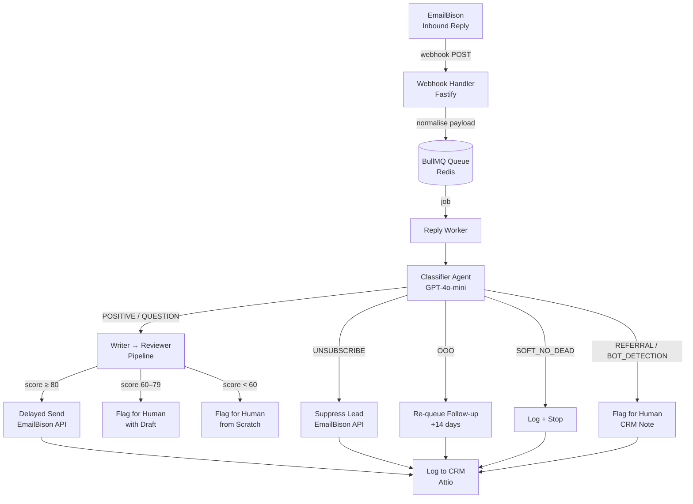
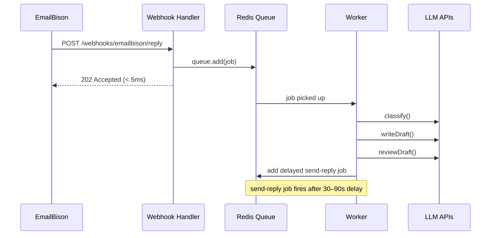
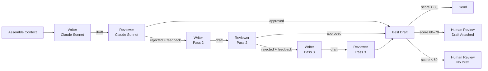

> Stack: TypeScript, Node.js, OpenAI, Anthropic (Claude), BullMQ, Redis, PostgreSQL, Drizzle ORM
> This is a real system running in production — not a toy demo.

---

I built an autonomous email reply agent that reads inbound replies to cold outreach campaigns, classifies the intent, drafts a reply, has another model review the draft, and sends it — all without a human in the loop.

Here's exactly how it works.

---

## The Problem

Cold outreach at scale generates a lot of inbound replies. Most of them fall into predictable buckets: someone's interested and wants to book a call, someone has a question, someone's out of office, someone wants to unsubscribe.

Handling each of these manually is a bottleneck. The replies come in at all hours, the window to respond is narrow, and the responses themselves follow consistent patterns.

This is exactly the kind of problem multi-agent systems are built for.

---

## The Architecture

The system has three layers:

1. **Ingestion** — a webhook receives the inbound reply, normalises the payload, and drops a job into a Redis queue
2. **Processing** — a worker picks up the job, classifies the intent, then routes it
3. **Action** — depending on intent, it either drafts and sends a reply, suppresses the lead, re-queues a follow-up, or flags for human review



Every path ends in a CRM note. Nothing gets lost.

---

## The Webhook Normalisation Layer

The first thing I had to solve: the real webhook payload from EmailBison looks nothing like what I assumed when I started building.

The actual payload is a nested envelope:

```json
{
  "event": { "type": "LEAD_REPLIED", ... },
  "data": {
    "reply": { "text_body": "...", "date_received": "..." },
    "lead": { "id": 1, "email": "...", ... },
    "sender_email": { "email": "...", "name": "..." },
    "scheduled_email": { "id": 4, "sequence_step_id": 2, ... },
    "campaign": { "id": 2 }
  }
}
```

Field names, nesting, types — all different from what the docs implied. `text_body` not `body_text`. `date_received` not `received_at`. Lead ID is a number, not a string. No `thread_id` anywhere — I use `scheduled_email.id` as the thread identifier for subsequent API calls.

Rather than update every handler to deal with this, I wrote a single normalisation function:

```ts
export function normalizeWebhookPayload(
  raw: RawEmailBisonWebhookPayload
): EmailBisonWebhookPayload {
  return {
    event: raw.event.type as "LEAD_REPLIED" | "LEAD_INTERESTED",
    thread_id: String(raw.data.scheduled_email.id),
    lead: {
      id: String(raw.data.lead.id),
      email: raw.data.lead.email,
      // ...
    },
    reply: {
      body_text: raw.data.reply.text_body,
      body_html: raw.data.reply.html_body,
      received_at: raw.data.reply.date_received,
      // ...
    },
  }
}
```

One transformation at the boundary. Everything downstream works with the clean internal type. If EmailBison changes their payload shape again, there's exactly one place to update.

---

## The Queue

The webhook handler does almost nothing. It validates the signature, normalises the payload, drops the job, and returns 202. Done in under 5ms.

```ts
app.post("/webhooks/emailbison/reply", async (request, reply) => {
  // validate signature...
  const payload = normalizeWebhookPayload(request.body)
  await replyQueue.add("process-reply", { payload }, {
    jobId: `reply-${payload.thread_id}-${Date.now()}`,
  })
  return reply.status(202).send({ queued: true })
})
```

The heavy work happens in the worker, asynchronously. This matters because the writer/reviewer pipeline makes multiple LLM calls — that takes seconds, sometimes longer. You cannot do that synchronously in a webhook handler.

BullMQ gives you durability (jobs survive restarts), retries (3 attempts with exponential backoff), and concurrency control (5 parallel workers).



---

## The Classifier

The classifier is the gatekeeper. It reads the raw email body and outputs one of eight intent buckets:

| Bucket | Action |
|---|---|
| `POSITIVE` | Draft and send reply |
| `QUESTION` | Draft and send reply |
| `SOFT_NO_NURTURE` | Flag for human |
| `SOFT_NO_DEAD` | Log and stop all comms |
| `UNSUBSCRIBE` | Suppress immediately — legal requirement |
| `OOO` | Re-queue follow-up 14 days out |
| `REFERRAL` | Flag for human — never auto-contact third parties |
| `BOT_DETECTION` | Flag for human — never auto-reply to "is this AI?" |

It runs on GPT-4o-mini. Fast, cheap, and good enough for classification — you don't need a frontier model to decide if someone said "remove me."

```ts
const ClassificationSchema = z.object({
  intent: z.enum([
    "POSITIVE", "QUESTION", "SOFT_NO_NURTURE", "SOFT_NO_DEAD",
    "UNSUBSCRIBE", "OOO", "REFERRAL", "BOT_DETECTION"
  ]),
  confidence: z.number().min(0).max(1),
  reasoning: z.string(),
})
```

The output is always structured. If the model hallucinates a field, Zod throws immediately.

---

## The Writer → Reviewer Loop

For intents that need a reply (`POSITIVE`, `QUESTION`), the job enters the writer/reviewer pipeline.



The Writer drafts the reply. The Reviewer scores it on multiple dimensions (tone, CTA clarity, length, persona fit) and either approves it or returns structured feedback. If rejected, the Writer gets the feedback and tries again. Maximum 3 passes.

The system tracks the best draft across all passes, not just the last one. Pass 3 isn't always better than Pass 2.

The Reviewer produces a composite score (0–100). Above 80: auto-send. 60–79: surface to human with the draft attached. Below 60: human writes from scratch.

---

## The Humanisation Delay

Sending a reply 3 seconds after receiving an email is obviously automated. The system adds a random 30–90 second delay before sending — enough to feel human, short enough to stay within a 2-minute response window.

The naive implementation would be:

```ts
// DO NOT do this
await new Promise(resolve => setTimeout(resolve, delayMs))
await sendReply(...)
```

That holds the BullMQ worker slot for up to 90 seconds. With 5 concurrent workers, you'd exhaust the pool fast.

The correct approach: enqueue a second job with BullMQ's built-in delay.

```ts
// In the writer/reviewer handler, after approval:
await sendReplyQueue.add("send-reply", jobData, { delay: randomSendDelayMs() })

// Separate minimal worker just handles the actual send:
const sendReplyWorker = new Worker("send-reply", async (job) => {
  await executeSendReply(job.data)
})
```

Job 1 (writer/reviewer) completes immediately and frees the worker. Job 2 (send) wakes up after the delay and does the actual send. Two jobs, clean separation, no blocked workers.

---

## The Integration Layer

Two external integrations: EmailBison (the sending platform) and Attio (the CRM).

**EmailBison** handles four operations:

```ts
suppressLead(leadId)                        // UNSUBSCRIBE — stop all sequences
requeueFollowUp(threadId, delayDays)        // OOO — reschedule 14 days out
sendReply({ threadId, body, ccEmail })      // send the actual reply
```

**Attio** handles two operations:

```ts
logClassifiedReply(params)   // creates a note on the person record
flagForTom(params)           // creates an urgent note for human review
markUnsubscribed(leadEmail)  // updates an attribute on the person record
```

The tricky part with Attio: the Notes API requires a record UUID as `parent_record_id`. It doesn't accept an email address directly. So every Attio call first does a lookup:

```ts
async function findPersonByEmail(email: string): Promise<string> {
  const res = await fetch(`${BASE_URL}/objects/people/records/query`, {
    method: "POST",
    body: JSON.stringify({
      filter: { email_addresses: { "$eq": email } },
      limit: 1,
    }),
  })
  const json = await res.json()
  return json.data[0].id.record_id
}
```

One extra API call per operation — acceptable for an async background job.

---

## Something I Learned

**Blocking delays in workers will kill you.** A `setTimeout` inside a job looks harmless until you're running at scale. Use the queue's built-in delay mechanism. Jobs are cheap. Worker slots are not.

**The normalisation layer is not optional.** External APIs change, have inconsistencies, and often don't match their docs. A single `normalize()` function at the boundary is the difference between a system that breaks everywhere and a system that breaks in one place.

---

## What's Next

- Wire up real Attio credentials and verify the `findPersonByEmail` filter works against a real workspace
- Parameterise the sender persona (Calendly link, video URL, sign-off) — currently hardcoded
- Add the `SOFT_NO_NURTURE` writer path (currently routes to human)
- Structured logging with Langfuse for observability across LLM calls

The core pipeline — webhook → queue → classify → write → review → send — is working end to end. Everything else is iteration.
