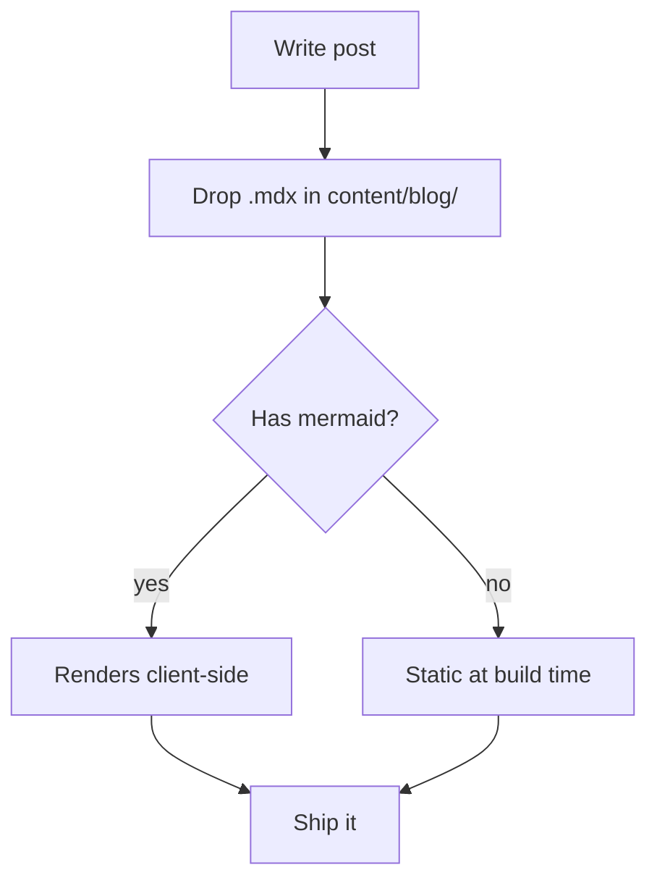

This is the first post on my site. It exists mostly to make sure everything works.

## How posts are structured

Posts live in `content/blog/` as `.mdx` files. Frontmatter handles the metadata:

```yaml
title: "Post title"
description: "One-line summary — used for the listing and SEO"
date: "YYYY-MM-DD"
tags: ["optional", "tags"]
draft: true  # omit or set false to publish
```

## Mermaid diagrams

You can include diagrams using fenced code blocks with the `mermaid` language tag:



## Markdown features

**Bold**, _italic_, `inline code`, and [links](https://rosekamal.com) all work.

> Blockquotes too.

Tables via GitHub Flavored Markdown:

| Frontmatter field | Required | Notes                    |
| ----------------- | -------- | ------------------------ |
| title             | yes      |                          |
| description       | yes      | Used in listing + OG     |
| date              | yes      | ISO format `YYYY-MM-DD`  |
| tags              | no       | Array of strings         |
| draft             | no       | Hides from listing       |

That's it. Write and ship.
