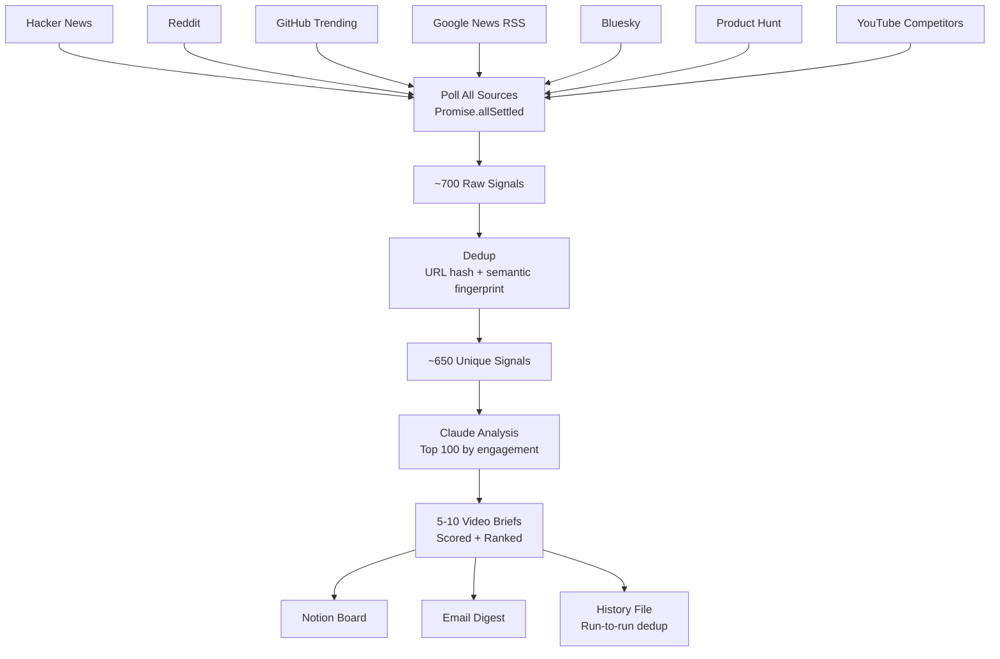
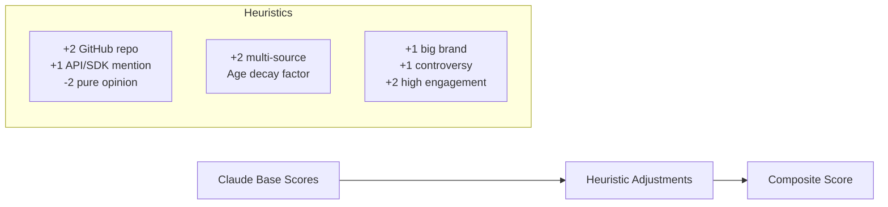
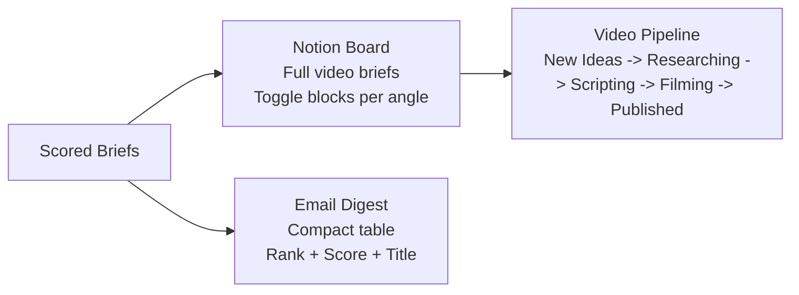

> Stack: TypeScript, Node.js, Claude API, Notion API, Resend, rss-parser
> Source: runs daily, delivers to Notion + email. No database.

---

I run a YouTube channel about vibe coding. The thesis is simple: less talking about AI, more building with it. Every video ships something real.

The problem: the AI space moves so fast that video-worthy events happen weekly. Tool launches, source code leaks, new capabilities dropping. Miss the window by three days and someone else already posted the tutorial. I was manually scrolling HN, Reddit, and Twitter every morning trying to catch these. That doesn't scale.

So I built an agent that does it for me. It crawls seven sources, deduplicates the signals, sends them to Claude for analysis, and delivers ranked video briefs to a Notion board. Each brief comes with multiple angles, hooks, thumbnail concepts, and intro options I can test before filming.

Here's exactly how it works.


## The Pipeline

The whole thing is a single TypeScript script that runs on a schedule. No framework, no database, no build step. Just `tsx` and a `.env` file.



Total runtime: about 2 minutes. Most of that is waiting for Claude.


## Sources

Each source is a module that exports one function: `poll(): Promise<RawSignal[]>`. They all run in parallel with `Promise.allSettled` so one failure doesn't kill the others.

```ts
interface RawSignal {
  sourceType: SourceType;
  title: string;
  url: string;
  body: string | null;
  author: string | null;
  engagementMetrics: {
    upvotes?: number;
    comments?: number;
    stars?: number;
  };
  publishedAt: string | null;
  tags: string[];
}
```

Every source returns the same shape. The pipeline doesn't care where a signal came from.

**Hacker News** is the easiest. Public API, no auth, zero cost. I poll `/topstories`, `/newstories`, and `/showstories`, fetch the top 100 items from each, and filter by AI keywords. Show HN posts are gold because they're almost always buildable.

**Reddit** uses the JSON API (append `.json` to any subreddit URL). Nine subreddits: `r/LocalLLaMA`, `r/ClaudeAI`, `r/ChatGPT`, `r/MachineLearning`, `r/artificial`, `r/ollama`, `r/singularity`, `r/cursor`, `r/vibecoding`. Hot posts with 20+ upvotes and new posts with 5+ upvotes. The only requirement is a descriptive `User-Agent` header.

**GitHub Trending** uses the search API with queries like `"AI agent" created:>2026-03-30 stars:>20 sort:stars`. Eight different queries cover the AI/dev-tools space. Works unauthenticated at 60 requests/hour, or add a token for 5,000/hour.

**Google News** is RSS feeds via `rss-parser`. Eight query feeds: "AI coding tool launch", "vibe coding", "Claude Code", "Cursor AI", etc. The `when:3d` parameter keeps results fresh.

**Bluesky** is the pleasant surprise. Fully open API, no auth needed, no rate limit drama. I poll 20 curated accounts (Simon Willison, Ethan Mollick, Andrej Karpathy, etc.) and filter for AI-related posts. This is where the high-signal, low-noise builder content lives now.

**Product Hunt** and **YouTube competitor channels** are optional. They need API keys but add useful signal: PH catches new tool launches, and YouTube shows what competitors are already covering.

On a typical run, I get about 700 raw signals. Here's the breakdown:

| Source | Signals | Auth Required |
| :--- | :--- | :--- |
| Hacker News | ~135 | No |
| Reddit | ~170 | No |
| GitHub Trending | ~70 | Optional |
| Google News | ~320 | No |
| Bluesky | ~6 | No |
| Product Hunt | varies | Yes |
| YouTube | varies | Yes |


## Deduplication

700 signals from seven sources means duplicates. The same Claude Code leak story is on HN, Reddit, and five Google News feeds simultaneously.

Three layers of dedup:

**Layer 1: URL hash.** Normalize the URL (strip UTM params, trailing slash, lowercase hostname), SHA-256 hash it, check against a persisted set.

**Layer 2: Semantic fingerprint.** Lowercase the title, strip stop words, sort the remaining words, hash. This catches "Anthropic launches Claude 4" on HN and "New Claude model drops" on Reddit, different URLs, same story.

**Layer 3: Run-to-run history.** After each run, I persist the generated topic titles to `data/history.json`. On the next run, these go into the Claude prompt so it doesn't regenerate briefs about the same topic.

```ts
function semanticFingerprint(title: string): string {
  const words = title
    .toLowerCase()
    .replace(/[^a-z0-9\s]/g, "")
    .split(/\s+/)
    .filter((w) => w.length > 1 && !STOP_WORDS.has(w))
    .sort();
  return sha256(words.join(" "));
}
```

The seen URLs file caps at 10,000 entries to prevent unbounded growth. History expires after 30 days.

After dedup, 700 signals typically drop to about 650. The real dedup value is across runs, when yesterday's 650 signals don't show up again today.


## The Brain: Claude Analysis

This is where raw signals become video briefs. The top 100 signals (by engagement) go into a single Claude call with a system prompt that encodes two things: my channel thesis and my video creation methodology.

The methodology matters. I don't just want "here's a topic." I want the full chain: **Topic -> Angle -> Hook**.

- **Topic**: What happened? (Claude Code source code leaked)
- **Angle**: What's the most gripping spin? (5 hidden workflow tricks buried in the source)
- **Hook**: The curiosity trigger that opens a loop (Claude Code has a feature they never told us about)

The system prompt is aggressive about buildability:

> Every angle MUST have a concrete build project. If you can't describe what gets built on screen, the angle is weak. Not "build something with the API" -- describe exactly what: "Build a CLI tool that uses the new streaming API to generate commit messages from staged diffs."

Claude returns structured output via `tool_use`:

```ts
interface VideoBrief {
  topic: string;
  whyNow: string;
  sources: {
    url: string;
    title: string;
    source: string;
    snippet: string;
  }[];
  angles: {
    angle: string;
    title: string;
    hook: string;
    thumbnailConcept: string;
    intros: {
      intro: string;
      payoff: string;
    }[];
    buildProject: string;
    format: "tutorial" | "deep-dive" | "speed-build" | "comparison" | "reaction";
    estimatedBuildTime: string;
  }[];
  scores: {
    buildability: number;
    timeliness: number;
    virality: number;
    composite: number;
  };
  tags: string[];
}
```

Each brief has 2-3 angles. Each angle has a title, hook, thumbnail concept, build project, and 2-3 intro options with different payoffs. The idea is that I can test intros before filming to see which payoff sticks.


## Scoring

The composite score weights buildability highest, because that's the channel's identity.

```
composite = (buildability * 0.50) + (timeliness * 0.30) + (virality * 0.20)
```

Claude provides the base scores. Heuristics adjust them:

**Buildability boosts:** +2 if a source is a GitHub repo (it's literally code you can build with). +1 if the text mentions API, SDK, or open-source. -2 if it's pure opinion with no builder angle.

**Timeliness boosts:** +2 if the topic appears on 3+ sources (trending signal). Age factor: less than 6 hours old scores highest, older than a week gets penalized.

**Virality boosts:** +1 for big-name brands (OpenAI, Anthropic, Google). +1 for controversy or drama keywords. +2 if total engagement across sources exceeds 5,000.

Scores are clamped to 1-10. On a typical run, the top brief scores 8-9.5.




## Delivery

Two outputs: Notion and email.

**Notion** is the primary interface. Each brief becomes a database page with properties (topic, status, scores, tags, date) and a structured body:

- A callout block with the "why now" context
- Scores as a single compact line
- Sources as linked bullet items with snippets
- Each angle as a **toggle block** (collapsed by default)
- Intros nested inside another toggle within each angle

The database has a kanban view with columns: New Ideas, Researching, Scripting, Filming, Published. The crawler creates pages in "New Ideas." I drag them through the pipeline.

Before creating a page, it queries the database to check if a similar topic already exists. No duplicates.

**Email** is a short notification. A table with rank, topic, best title, and score. No expanded briefs. The email's job is to tell me "you have new ideas, go check Notion."




## Running It

```bash
# full run: poll -> analyze -> notion + email
npx tsx --env-file=.env scripts/run.ts

# dry run: signals only, no Claude call, no delivery
npx tsx --env-file=.env scripts/run.ts --dry-run

# specific sources only
npx tsx --env-file=.env scripts/run.ts --sources=hackernews,reddit

# skip email or notion
npx tsx --env-file=.env scripts/run.ts --no-email
npx tsx --env-file=.env scripts/run.ts --no-notion
```

The project structure:

```
yt-idea-crawler/
  scripts/
    run.ts                # Main pipeline
    setup-notion.ts       # One-time DB setup
  src/
    sources/              # One module per source
    analysis/             # Claude + scoring
    dedup/                # URL hash + fingerprint + history
    delivery/             # Notion + email
    types.ts
    config.ts
  data/                   # Persisted state (gitignored)
    seen-urls.json
    history.json
```

No build step. No database. No Docker. Just `npm install` and `npx tsx`.


## What It Actually Found

On the first real run, the crawler surfaced five briefs. The top one scored 9.5/10:

| # | Topic | Score |
| :--- | :--- | :--- |
| 1 | Gemma 4 performance breakthrough -- replace Copilot locally | 9.5 |
| 2 | AI job search system (740+ listings, open sourced) | 8.7 |
| 3 | Claude Code found 23-year-old Linux vulnerability | 8.5 |
| 4 | DeepSeek censorship controversy | 8.5 |
| 5 | Claude has 171 measurable emotion vectors | 7.9 |

Every single one of these had happened in the previous 48 hours. Every single one had a concrete build project attached. The Gemma 4 brief came with two angles: "I Replaced GitHub Copilot With Gemma 4 Running Locally" (tutorial, ~90 min) and "I'm Rebuilding My $5000/Month AI App with Gemma 4" (deep-dive, ~2 hours).

Before this tool, I would have caught maybe two of these by scrolling HN. The Claude Code vulnerability story was only on HN. The emotion vectors research was only on Reddit. The Gemma 4 signal was across all three. I would have missed the cross-source pattern entirely.


## What I'd Do Differently

**Start with fewer sources.** I built all seven before testing end-to-end. Should have shipped HN alone, verified the whole pipeline worked, then added sources one at a time. I did eventually restructure into phases, but I should have committed to that from the start.

**The keyword filter is too aggressive.** "AI" matches "Artemis II" (the space mission). A space article about the Artemis crew kept showing up in results because the URL contained "ai." Need to move to phrase matching or a lightweight classifier for pre-filtering.

**Bluesky over Twitter.** I spent time building a Nitter RSS scraper for Twitter that returns zero results because every public Nitter instance is dead. Bluesky took 20 minutes to build, works perfectly, and has better signal quality for my niche. Should have started there.


## The Actual ROI

The tool cost about a day to build across six phases. It runs in 2 minutes, costs maybe $0.10 per run in Claude API fees, and surfaces 5-10 video ideas daily with full briefs.

The real value isn't the ideas themselves. It's the angles. Coming up with "Claude Code found a Linux vulnerability" is easy. Coming up with "I Built an AI Bug Hunter That Found What Humans Missed for 23 Years" as a title, "Split screen: dusty old Linux code on left, glowing AI eye scanning it on right" as a thumbnail concept, and two different intro options with different payoffs -- that's the work that used to take me hours of staring at a blank doc.

Now I wake up, check Notion, pick the brief with the highest score, and start scripting.
