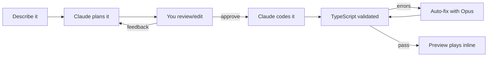
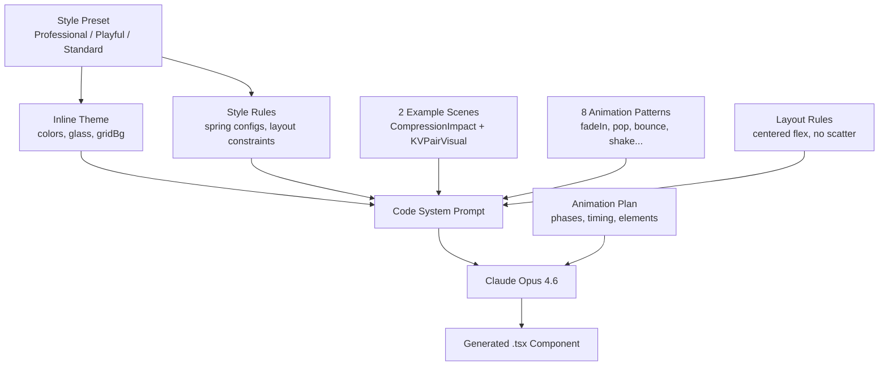
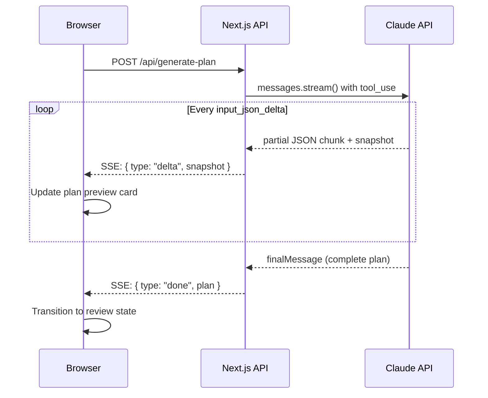
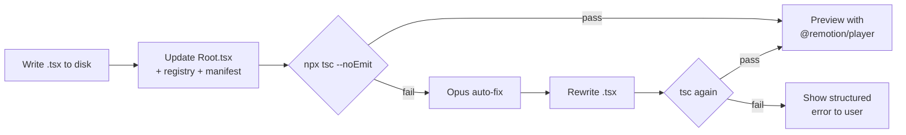
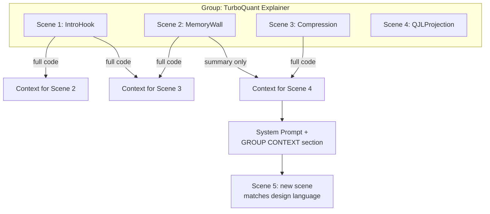

I make YouTube videos about building with AI. The videos need animations. Explainer clips, data visualizations, concept breakdowns. 5-10 second scenes that make technical ideas click visually.

Problem: I'm not a motion designer. I'm barely an editor. After Effects is a foreign language to me. Figma's animation tools give me anxiety. And hiring someone for every little 8-second clip explaining how a KV cache works is not realistic when I'm shipping videos weekly.

So a few weeks ago I started building Animotion. You describe what you want in plain English, Claude generates the animation as production-ready React code, and you preview it right in the browser. No timeline. No keyframes. Just a prompt and a player.

Here's how the whole thing works, what actually shipped, and what I'm building next.

## The Stack

Animotion is a Next.js app that generates [Remotion](https://remotion.dev) components. Remotion lets you create videos using React. Every animation is a `.tsx` file that uses `useCurrentFrame()`, `spring()`, and `interpolate()` instead of a timeline. You write code, Remotion renders it to MP4.

The AI part: Claude plans the animation (phases, timing, visual elements), then Claude Opus writes the full component. The file gets written to disk, TypeScript-validated, auto-fixed if needed, registered in the Remotion project, and previewed inline via `@remotion/player`.



Two models handle different jobs:

| Step | Model | Why |
|------|-------|-----|
| Planning | Sonnet 4.6 | Fast structured output via tool_use |
| Code generation | Opus 4.6 | Best code quality for complex layouts |
| Auto-fix | Opus 4.6 | Fixes TS errors if first pass has issues |
| Plan revision | Sonnet 4.6 | Multi-turn context for feedback loops |

## The Origin Story

This started because I was making a video about TurboQuant, a KV cache compression paper from Google Research. The video needed like 20 animation clips. Memory walls, cache growth charts, compression visualizations, error projections. All with the same dark theme, same colors, same animation style.

I built all 20 scenes by hand with Claude Code in Remotion. It took a while but they looked good. Cyan and purple on black, glass-morphism cards, bouncy springs for impact moments, smooth fades for text. A consistent design language across every clip.

Halfway through I realized: this is a workflow that could be a product. Not "AI generates random animations." More like: you describe what you want, you get a structured plan, you edit the timing, you approve, and the code streams in live. The key insight was that the system prompt matters more than anything. Two complete example scenes, strict layout rules, an inline color theme, and explicit animation patterns. That's what makes the output actually usable instead of a mess of absolute-positioned divs.

## What's Shipped

### Style Presets

Three hard-coded styles that affect both planning and code generation:

**Professional** is white backgrounds, blue primary, Inter font, smooth springs only. No bounce, no glow, no fun. Think Stripe dashboard or a corporate keynote.

**Playful** is warm pink backgrounds, thick borders, bouncy everything. Scale pops, slight rotation on entrance, overshooting springs. Think product launch or social media content.

**Standard** is the original look from my TurboQuant scenes. Light gray background, cyan and purple accents, glass-morphism cards, grid overlay. Mix of bouncy and smooth springs.

Each preset injects its own colors, glass styles, grid background, spring configs, and design rules directly into the system prompt. The code gen model copies the inline theme into every component it generates.



### Plan Review

After Claude generates a plan, you don't just approve or reject. You can:

- Edit the overall duration and FPS
- Adjust individual phase start/end times (each phase card has inline number inputs)
- Write feedback in a textarea and hit "Revise Plan"

The revision uses multi-turn conversation. Claude sees its original plan as a previous tool_use response, then gets your feedback as a follow-up. It regenerates incorporating the changes. You can revise as many times as you want before approving.

### Streaming

Both plan generation and code generation stream to the UI in real-time.



For the plan, I'm using Anthropic's `inputJson` event from the streaming SDK. It fires on every `input_json_delta` and gives you a `jsonSnapshot`, which is the SDK's incrementally parsed JSON object. So the plan card fills in progressively. Scene name appears, then description, then phases pop in one by one, then visual elements. The snapshot is throttled to emit every 150ms to prevent React from batching 50 events into one render.

For code generation, the TSX streams token by token into a code block with a live line counter. You watch your component being written. It's satisfying as hell.

### In-Browser Preview

After the code is written, `@remotion/player` renders it inline. Full playback controls, scrubber, loop. No need to open Remotion Studio in another terminal.

Getting this to work with Next.js 16 and Turbopack was a pain. The main issue: the generated components live in `remotion/src/generated/` which has its own `node_modules/remotion`. The Player uses the root `node_modules/remotion`. Two different Remotion instances means `useCurrentFrame()` throws "can only be called inside a component that was passed to Player."

The fix was forcing all `remotion` imports to resolve to the root copy via webpack and Turbopack aliases. Plus a registry file (`_registry.ts`) that re-exports all generated components by name, so the dynamic import uses a static path that Turbopack can actually resolve.

### 1080p Rendering

A render button in the done state shells out `npx remotion render` and serves the MP4 for download. Takes 5-30 seconds depending on scene complexity. Nothing fancy, but it means you can go from prompt to downloadable video without touching a terminal.

### Session Persistence

Everything persists in `sessionStorage`. If code gen fails or you accidentally refresh, you're back in the review state with your plan intact. Mid-stream states snap back safely: `planning` goes to `idle`, `generating` goes to `reviewing`. "Start Over" clears it.

### TypeScript Validation

After writing the scene file, the system runs `npx tsc --noEmit` against the Remotion project. If it finds errors, Opus takes a crack at fixing them automatically.



The UI shows a step-by-step progress: writing file, validating TypeScript, auto-fixing. If it still fails, you see the errors in a structured format with error code, file, line number, not just a wall of red text.

## What Didn't Work (At First)

**The code quality was terrible initially.** The first version used Sonnet with a thin system prompt. The output was basic. Text fading in, random colors, no layout discipline. I upgraded to Opus with `max_tokens: 16384`, embedded two complete real scene examples (CompressionImpact and KVPairVisual from TurboQuant), added an inline theme block, 8 animation pattern recipes, and a design principles section. Night and day difference.

**Layout was the biggest quality problem.** Even with Opus, the model would scatter elements with random absolute positioning. Labels floating on the left, stats pushed to the right edge, nothing centered. I added explicit LAYOUT RULES to the system prompt: single centered flex container, no scattered absolute positioning, labels must be inside or adjacent to their visual, max 2 levels of nesting, 80% center zone. That fixed most of it.

**Plan generation would sometimes return empty phases.** The plan uses Claude's tool_use API for structured JSON output. With complex prompts generating 30+ visual elements, it would hit the 4096 token limit before completing the phases array. Bumped it to 8192 and the issue went away.

**The streaming plan preview appeared in bursts.** The initial fields (name, description) streamed progressively, then all the phases appeared at once. Root cause: every SSE event was sending the full JSON snapshot object, which grew to 5-10KB for later events. Browser batched them into one TCP packet, React batched the state updates. Fix: throttle snapshot emission to every 150ms.

## The UI

The app uses shadcn/ui with a Luma style, teal primary on a mist (blue-gray) base. Phosphor icons. The layout is a single column with a step indicator at the top (Describe, Review, Generate, Done) and cards for each state.

Style presets show mini preview swatches with a fake card shape, a color bar showing primary and accent colors, and trait pills like "Smooth fades" or "Bouncy springs" so you know what you're picking before you commit.

## What's Next: Groups

Right now every animation is standalone. That's fine for one-offs but it's not how I actually work. For a video, I need 8-12 clips that all look the same. Same colors, same animation feel, same font loading, same grid background.

The next feature is groups. You create a group ("TurboQuant Explainer"), pick a style, and start adding scenes. Each new scene in the group sees the code from previous scenes via a rolling window: the 2 most recent scenes are included as full code references in the system prompt, older scenes get reduced to summaries. This way Claude always matches the design language without you having to describe it every time.



The layout changes too. Moving from the current single-column flow to a sidebar layout like Remotion Studio. Left side: groups and scenes in a collapsible tree. Right side: the creation flow or a scene preview depending on what's selected.

The data model is simple. A `groups.json` file tracks groups and their scenes. Files stay flat in the generated directory. Root.tsx registers group scenes in Remotion `<Folder>` components.

That's the plan. I'll write about it once it ships.

## Try It

It's open source: [github.com/rosekamallove/animotion](https://github.com/rosekamallove/animotion)

BYOK. You need an Anthropic API key with access to Opus and Sonnet.

```bash
git clone https://github.com/rosekamallove/animotion.git
cd animotion
npm install
cd remotion && npm install && cd ..
cp .env.local.example .env.local
# add your ANTHROPIC_API_KEY
npm run dev
```

Open localhost:3000. Describe something. Watch it build.
