# Learning Plan: OIDC & Better Auth

A ground-up guide for understanding OpenID Connect and Better Auth, specifically
for building a unified auth server for the product suite.

---

## Table of Contents

1. [Part 1: OAuth 2.0 -- The Foundation](#part-1-oauth-20----the-foundation)
2. [Part 2: OpenID Connect (OIDC) -- The Identity Layer](#part-2-openid-connect-oidc----the-identity-layer)
3. [Part 3: OIDC Provider vs Client](#part-3-oidc-provider-vs-client)
4. [Part 4: OIDC for Multi-Product SaaS](#part-4-oidc-for-multi-product-saas)
5. [Part 5: Better Auth -- The Framework](#part-5-better-auth----the-framework)
6. [Part 6: Better Auth as an OIDC Provider](#part-6-better-auth-as-an-oidc-provider)
7. [Part 7: Better Auth Organizations Plugin](#part-7-better-auth-organizations-plugin)
8. [Part 8: How It All Fits for the product suite](#part-8-how-it-all-fits-for-the product suite)
9. [Reading List & Tutorials](#reading-list--tutorials)

---

## Part 1: OAuth 2.0 -- The Foundation

Before understanding OIDC, you need OAuth 2.0. OIDC is built directly on top of it.

### What is OAuth 2.0?

OAuth 2.0 is an **authorization** framework. It answers: **"What are you allowed to access?"**

It lets an application (like App A) request limited access to a user's resources
on another service, without the user sharing their password.

### The Four Roles

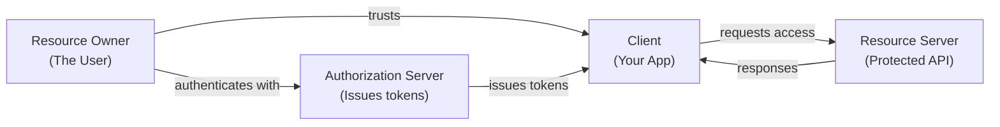

- **Resource Owner**: The user who owns the data
- **Client**: The app requesting access (e.g., App A frontend)
- **Authorization Server**: Issues tokens after authenticating the user
- **Resource Server**: The API that holds protected data

### OAuth 2.0 Only Does Authorization

Here's the key limitation: OAuth 2.0 gives you an **access token** that says
"this token can access these resources." But it does NOT tell you **who the user is**.

That's where OIDC comes in.

---

## Part 2: OpenID Connect (OIDC) -- The Identity Layer

### What is OIDC?

**OIDC = OAuth 2.0 + Authentication**

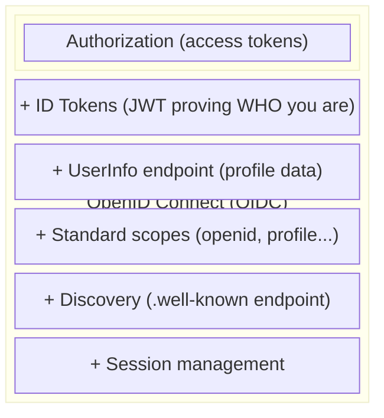

OAuth 2.0 answers: "Can this app access this API?"
OIDC answers:      "Who is this user?"

### The Three Tokens

```
Authorization Code Flow Response:
{
  "id_token":      "eyJhb...",   <-- WHO the user is (JWT, signed)
  "access_token":  "eyJhb...",   <-- WHAT they can access
  "refresh_token": "dGhpcw..."   <-- Get new tokens without re-login
}
```

#### ID Token (the OIDC addition)

A signed JWT that proves the user's identity. Decoded, it looks like:

```json
{
  "iss": "https://auth.example.com",       // Who issued this token (your OIDC server)
  "sub": "user_abc123",                    // Unique user identifier
  "aud": "app-a-client",          // Which app this token is for
  "exp": 1712345678,                       // When it expires
  "iat": 1712342078,                       // When it was issued
  "email": "alice@company.com",            // User's email
  "name": "Alice Smith",                   // User's name
  "email_verified": true                   // Whether email is verified
}
```

The ID token is **signed** with the server's private key. Any app can verify it
using the server's **public key** (fetched from the JWKS endpoint). No shared secrets needed.

#### Access Token

Grants permission to call APIs. Can be opaque (random string) or a JWT.
Sent as `Authorization: Bearer <token>` in API requests.

#### Refresh Token

Long-lived token used to get new access/ID tokens without making the user log in again.
Stored securely server-side, never exposed to the browser.

### The Authorization Code Flow (The Main Flow)

This is the flow you'll implement. Step by step:

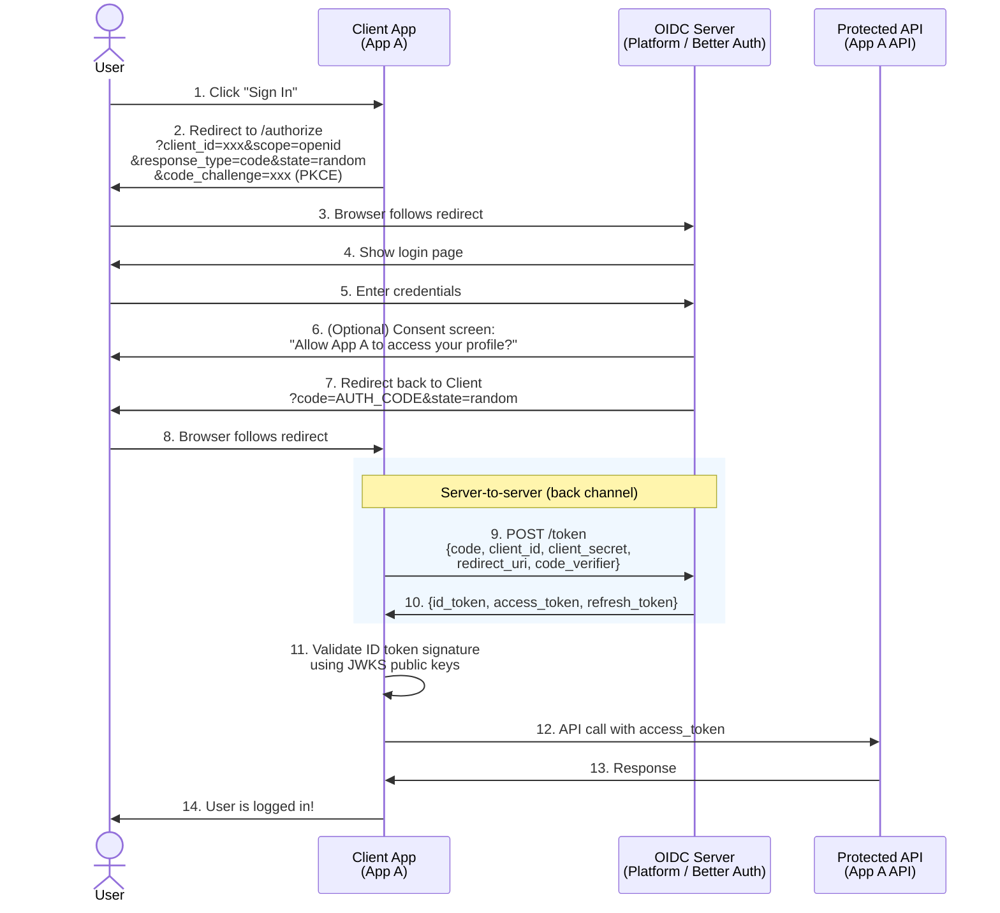

### PKCE (Proof Key for Code Exchange)

An extra security layer now **required** in OAuth 2.1 / modern OIDC:

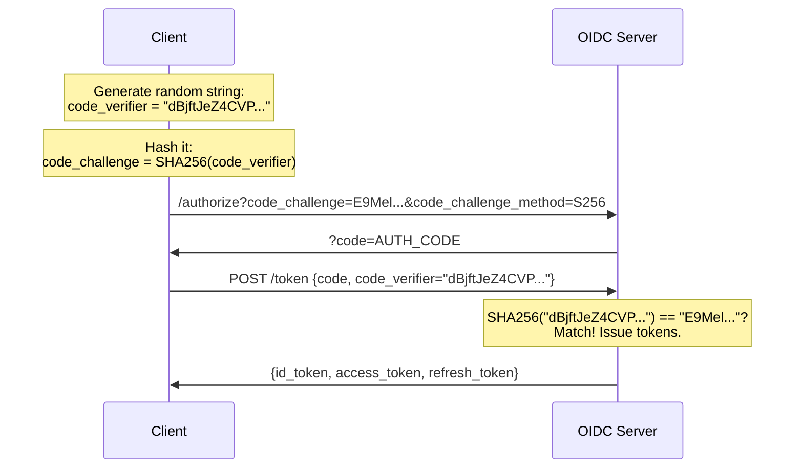

This prevents intercepted auth codes from being used by attackers --
they don't have the original `code_verifier`.

### OIDC Scopes

Every OIDC request MUST include the `openid` scope. Additional scopes control
what user data is returned:

```
scope=openid            --> Just the sub (user ID)
scope=openid profile    --> + name, picture, gender, birthdate, locale...
scope=openid email      --> + email, email_verified
scope=openid phone      --> + phone_number, phone_number_verified
scope=openid address    --> + structured address object

// For the product suite, you'll likely use:
scope=openid profile email
```

### The 5 Key OIDC Endpoints

Every OIDC Provider exposes these endpoints:

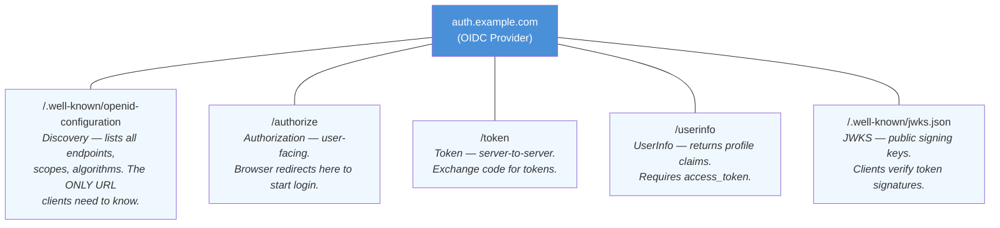

#### Discovery Document Example

```json
GET https://auth.example.com/.well-known/openid-configuration

{
  "issuer": "https://auth.example.com",
  "authorization_endpoint": "https://auth.example.com/authorize",
  "token_endpoint": "https://auth.example.com/token",
  "userinfo_endpoint": "https://auth.example.com/userinfo",
  "jwks_uri": "https://auth.example.com/.well-known/jwks.json",
  "scopes_supported": ["openid", "profile", "email", "offline_access"],
  "response_types_supported": ["code"],
  "grant_types_supported": ["authorization_code", "refresh_token", "client_credentials"],
  "subject_types_supported": ["public"],
  "id_token_signing_alg_values_supported": ["RS256"],
  "token_endpoint_auth_methods_supported": ["client_secret_basic", "client_secret_post"]
}
```

---

## Part 3: OIDC Provider vs Client

This is the most important distinction for the product suite.

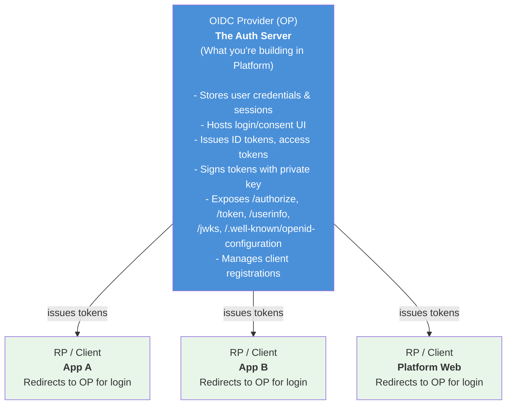

### You are building the Provider (OP)

In Platform, you'll build the OIDC Provider. This means:
- Platform hosts the login page, consent screen, and all OIDC endpoints
- Platform stores users, passwords, sessions, and OAuth provider links
- Platform signs tokens with its private key

### App A and App B become Clients (RPs)

Each product registers as a client with the Platform OIDC server:
- App A gets `client_id: "app-a"` and a `client_secret`
- App B gets `client_id: "app-b"` and a `client_secret`
- When a user clicks "Sign In" in App A, they're redirected to the Platform login page
- After login, they're redirected back to App A with tokens

---

## Part 4: OIDC for Multi-Product SaaS

### Single Sign-On (SSO) -- The Main Benefit

With a central OIDC provider, users log in ONCE and are authenticated across all products:

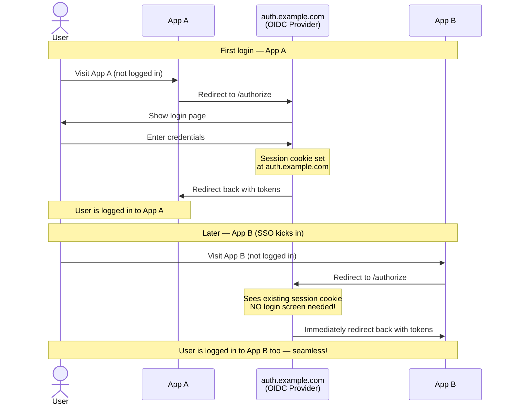

### Organization/Tenant Context in Tokens

For multi-tenant apps, the OIDC server can include organization info in tokens:

```json
{
  "sub": "user_abc123",
  "email": "alice@company.com",
  "org_id": "org_xyz789",
  "org_role": "admin",
  "org_name": "Acme Corp"
}
```

Each product reads the `org_id` from the token and scopes all data to that org.

### Client Registration

Each product/app must be registered with the OIDC server:

```
+--------------------------+----------------------------+
| Client ID                | app-a-prod           |
| Client Secret            | sk_live_xxx...             |
| Redirect URIs            | https://app-a.example.com |
|                          |   /api/auth/callback       |
| Allowed Scopes           | openid profile email       |
| Token Expiry             | access: 1h, refresh: 30d   |
| Trusted?                 | Yes (skip consent screen)  |
+--------------------------+----------------------------+
```

Trusted/first-party clients (your own apps) can skip the consent screen.
Third-party clients would see "Allow X to access your profile?"

---

## Part 5: Better Auth -- The Framework

### What Is It?

Better Auth is a **TypeScript-first authentication framework** that runs on any
Node.js backend. It's the auth library you'll use to build the OIDC server in Platform.

- Docs: https://better-auth.com/docs/introduction
- GitHub: https://github.com/better-auth/better-auth

### Architecture

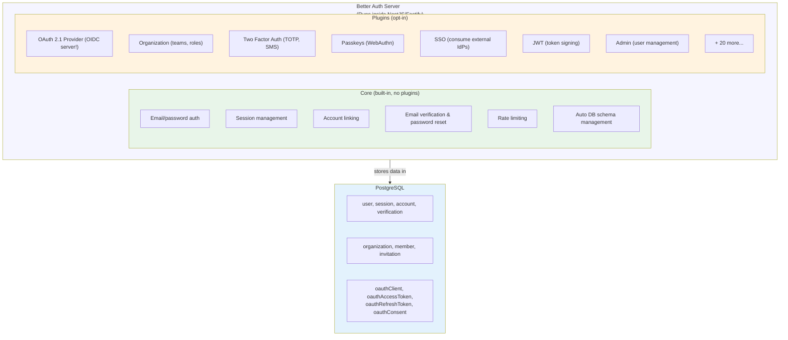

### Basic Setup

```typescript
// auth.ts -- Server setup
import { betterAuth } from "better-auth";
import { Pool } from "pg";

export const auth = betterAuth({
  database: new Pool({
    connectionString: process.env.DATABASE_URL,  // PostgreSQL
  }),
  emailAndPassword: {
    enabled: true,
  },
  socialProviders: {
    google: {
      clientId: process.env.GOOGLE_CLIENT_ID!,
      clientSecret: process.env.GOOGLE_CLIENT_SECRET!,
    },
  },
});
```

```typescript
// auth-client.ts -- Client setup (browser)
import { createAuthClient } from "better-auth/client";

export const authClient = createAuthClient({
  baseURL: "https://auth.example.com",
});

// Usage in React:
await authClient.signIn.email({ email, password });
await authClient.signIn.social({ provider: "google" });
const session = await authClient.getSession();
```

### Database Adapters

Better Auth supports multiple database options:

```
Direct drivers (via Kysely):
  - PostgreSQL (pg Pool)        <-- Best for Platform (already uses PG)
  - MySQL
  - SQLite

ORM adapters:
  - Drizzle ORM                 <-- Best supported ORM option
  - Prisma
  - MikroORM (community)       <-- Exists but requires manual schema mgmt
  - Kysely (native)
```

For Platform, two realistic options:
1. **Direct `pg` Pool** -- simplest, Better Auth auto-manages schema
2. **Drizzle adapter** -- if you want ORM-level type safety for auth tables

The existing Platform codebase uses MikroORM. A community adapter exists
(`better-auth-mikro-orm`) but it requires manual entity/migration management.
You might want Better Auth to use its own `pg` Pool connection alongside MikroORM
for the rest of Platform -- keeping auth schema management automatic.

### Session Management

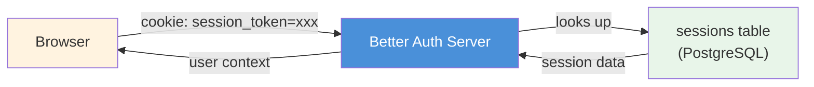

**Options for performance:**
- Cookie caching (store session in signed/encrypted cookie to skip DB lookup)
- Secondary storage (Redis) for session data
- Stateless mode (no DB, session lives in encrypted cookie only)

Default: 7-day expiry, auto-refreshed every 24 hours.

---

## Part 6: Better Auth as an OIDC Provider

This is the critical plugin. There are two versions:

- `oidcProvider` from `better-auth/plugins` -- **being deprecated**
- `oauthProvider` from `@better-auth/oauth-provider` -- **the current recommended path**

Use the **OAuth 2.1 Provider plugin**. It implements full OIDC on top of OAuth 2.1.

### Setup

```typescript
import { betterAuth } from "better-auth";
import { oauthProvider } from "@better-auth/oauth-provider";

export const auth = betterAuth({
  database: new Pool({ connectionString: process.env.DATABASE_URL }),

  plugins: [
    oauthProvider({
      // Where to redirect for login (your login UI)
      loginPage: "/sign-in",

      // Where to redirect for consent (your consent UI)
      consentPage: "/consent",

      // Supported OIDC scopes
      scopes: ["openid", "profile", "email", "offline_access"],

      // Token lifetimes
      accessTokenExpiresIn: "1h",       // Short-lived
      refreshTokenExpiresIn: "30d",     // Long-lived

      // Custom claims on tokens (e.g., org info)
      async customClaims({ user, scopes, request }) {
        return {
          org_id: user.activeOrganizationId,
          org_role: user.role,
        };
      },
    }),
  ],
});
```

### What It Creates

```
Database tables added:
  - oauthClient        (registered apps: client_id, secret, redirect_uris)
  - oauthAccessToken   (issued access tokens)
  - oauthRefreshToken  (issued refresh tokens)
  - oauthConsent       (user consent records per client)

Endpoints exposed:
  GET  /.well-known/openid-configuration   (Discovery)
  GET  /oauth2/authorize                    (Authorization)
  POST /oauth2/token                        (Token exchange)
  GET  /oauth2/userinfo                     (User profile)
  GET  /.well-known/jwks.json               (Public signing keys)
  POST /oauth2/revoke                       (Token revocation)
  POST /oauth2/token/introspect             (Token introspection)
  POST /oauth2/register                     (Dynamic client registration)
```

### Registering the product suite Apps as Clients

```typescript
// Register App A as a client (can be done via API or DB seed)
await auth.api.oauthProvider.registerClient({
  name: "App A",
  redirectUris: ["https://app-a.example.com/api/auth/callback"],
  scopes: ["openid", "profile", "email"],
  trusted: true,  // Skip consent screen for first-party apps
});

// Register App B as a client
await auth.api.oauthProvider.registerClient({
  name: "App B",
  redirectUris: ["https://app-b.example.com/api/auth/callback"],
  scopes: ["openid", "profile", "email"],
  trusted: true,
});
```

### Full Flow: User Signs Into App A

```
1. User clicks "Sign In" on App A
2. App A redirects to:
   https://auth.example.com/oauth2/authorize
     ?client_id=app-a
     &redirect_uri=https://app-a.example.com/api/auth/callback
     &scope=openid+profile+email
     &response_type=code
     &state=random123
     &code_challenge=E9Mel...
     &code_challenge_method=S256

3. Better Auth (Platform) shows login page
4. User enters credentials (or uses Google OAuth)
5. Better Auth authenticates user, creates session
6. Better Auth redirects back:
   https://app-a.example.com/api/auth/callback
     ?code=AUTH_CODE_HERE
     &state=random123

7. App A backend exchanges code:
   POST https://auth.example.com/oauth2/token
   {
     grant_type: "authorization_code",
     code: "AUTH_CODE_HERE",
     client_id: "app-a",
     client_secret: "sk_xxx...",
     redirect_uri: "https://app-a.example.com/api/auth/callback",
     code_verifier: "dBjft..."
   }

8. Better Auth returns:
   {
     id_token: "eyJ...",       // JWT: who the user is
     access_token: "eyJ...",   // JWT: what they can access
     refresh_token: "xxx...",  // For getting new tokens
     token_type: "Bearer",
     expires_in: 3600
   }

9. App A validates id_token signature using JWKS
10. User is logged in!
```

---

## Part 7: Better Auth Organizations Plugin

This plugin handles multi-tenancy: orgs, members, roles, invitations.

### Setup

```typescript
import { organization } from "better-auth/plugins";
import { createAccessControl } from "better-auth/plugins/access";

// Define your role permissions
const ac = createAccessControl({
  org: ["delete", "transfer", "update"],
  member: ["invite", "remove", "update-role"],
  billing: ["manage"],
  kb: ["create", "delete", "update"],
  chatbot: ["create", "delete", "manage"],
});

// Define roles with their permissions
const roles = ac.newRole({
  owner: ac.allow("org", ["delete", "transfer", "update"])
           .allow("member", ["invite", "remove", "update-role"])
           .allow("billing", ["manage"])
           .allow("kb", ["create", "delete", "update"])
           .allow("chatbot", ["create", "delete", "manage"]),

  admin: ac.allow("org", ["update"])
           .allow("member", ["invite", "remove", "update-role"])
           .allow("billing", ["manage"])
           .allow("kb", ["create", "delete", "update"])
           .allow("chatbot", ["create", "delete", "manage"]),

  member: ac.allow("kb", ["create", "update"])
            .allow("chatbot", ["manage"]),
});

export const auth = betterAuth({
  plugins: [
    organization({
      roles,
      // Default role for new members
      defaultRole: "member",
      // Allow creator to set org slug
      allowUserToCreateOrganization: true,
      // Teams within orgs (optional)
      teams: {
        enabled: true,
        maximumTeams: 10,
      },
      // Invitations
      invitations: {
        expiresIn: 7 * 24 * 60 * 60, // 7 days in seconds
        sendInvitationEmail: async ({ email, organization, invitedBy, role }) => {
          // Send email via your email service (SES, Resend, etc.)
        },
      },
    }),
  ],
});
```

### Database Tables

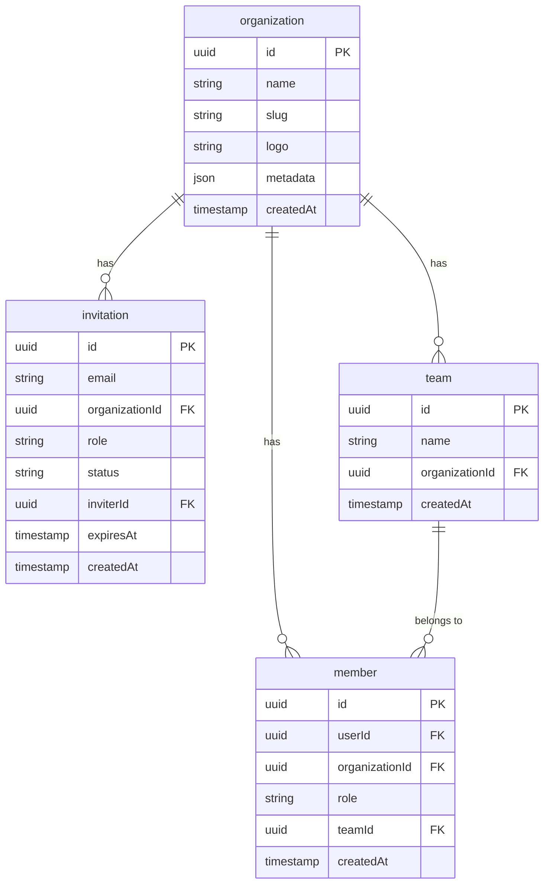

### Client-Side Usage

```typescript
import { createAuthClient } from "better-auth/client";
import { organizationClient } from "better-auth/client/plugins";

const client = createAuthClient({
  baseURL: "https://auth.example.com",
  plugins: [organizationClient()],
});

// Create org
await client.organization.create({ name: "Acme Corp", slug: "acme" });

// List user's orgs
const orgs = await client.organization.list();

// Set active org (stored in session)
await client.organization.setActive({ organizationId: "org_xxx" });

// Invite member
await client.organization.inviteMember({
  email: "bob@acme.com",
  role: "admin",
});

// Check permissions
const canDelete = await client.organization.hasPermission({
  permission: { org: ["delete"] },
});
```

---

## Part 8: How It All Fits for the product suite

### The Final Architecture

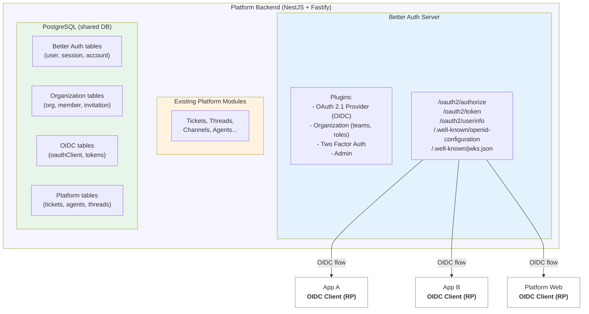

Each app:
- Has a `client_id` + `client_secret`
- Redirects to Platform for login
- Receives tokens after auth
- Validates tokens via JWKS
- Reads `org_id` from token claims

### What Changes in Each Product

**Platform (the OIDC Provider):**
- Replace existing auth provider with Better Auth
- Add OAuth 2.1 Provider plugin + Organization plugin
- Internal user entities map to Better Auth user via ba_user_id
- Hosts login/signup UI at auth.example.com

**App A (becomes OIDC Client):**
- Replace existing auth library with an OIDC client library (e.g., `openid-client`)
- Remove local user/session tables (read from tokens instead)
- Workspace becomes a reference to the unified org_id from token claims
- Product-specific permissions stay local

**App B (becomes OIDC Client):**
- Replace existing auth library with an OIDC client library
- Remove local auth dependency
- Account becomes a reference to the unified org_id from token claims
- Product features stay product-local

---

## Reading List & Tutorials

### Recommended Learning Order

**Week 1: Understand OIDC (before touching any code)**

| # | Resource | Type | Time | Link |
|---|----------|------|------|------|
| 1 | How OpenID Connect Works | Overview | 10 min | https://openid.net/developers/how-connect-works/ |
| 2 | Connect2id: OpenID Connect Explained | Deep guide | 45 min | https://connect2id.com/learn/openid-connect |
| 3 | Okta: OAuth 2.0 and OIDC Overview | Guide + diagrams | 30 min | https://developer.okta.com/docs/concepts/oauth-openid/ |
| 4 | Auth0: OpenID Connect Protocol | Reference | 20 min | https://auth0.com/docs/authenticate/protocols/openid-connect-protocol |
| 5 | Auth0: The OpenID Connect Handbook | Free ebook | 2-3 hrs | https://auth0.com/resources/ebooks/the-openid-connect-handbook |
| 6 | Curity: Getting Started with OAuth & OIDC | Video course (8 parts) | 4 hrs | https://curity.io/resources/webinars/course-getting-started-with-oauth-and-openid-connect/ |

**Week 2: Understand Better Auth**

| # | Resource | Type | Time | Link |
|---|----------|------|------|------|
| 1 | Better Auth Introduction | Docs | 15 min | https://better-auth.com/docs/introduction |
| 2 | Better Auth Concepts: Database | Docs | 15 min | https://better-auth.com/docs/concepts/database |
| 3 | Better Auth Concepts: Session Management | Docs | 15 min | https://better-auth.com/docs/concepts/session-management |
| 4 | Better Auth: Organization Plugin | Docs | 30 min | https://better-auth.com/docs/plugins/organization |
| 5 | Better Auth: OAuth 2.1 Provider Plugin | Docs | 30 min | https://better-auth.com/docs/plugins/oauth-provider |
| 6 | Better Auth: PostgreSQL Adapter | Docs | 10 min | https://better-auth.com/docs/adapters/postgresql |
| 7 | Better Auth GitHub (browse examples) | Code | 30 min | https://github.com/better-auth/better-auth |

### Reference Specifications (keep handy, don't read cover to cover)

| Spec | Link |
|------|------|
| OpenID Connect Core 1.0 | https://openid.net/specs/openid-connect-core-1_0.html |
| OpenID Connect Discovery 1.0 | https://openid.net/specs/openid-connect-discovery-1_0.html |
| OAuth 2.0 (RFC 6749) | https://datatracker.ietf.org/doc/html/rfc6749 |
| OAuth 2.1 (Draft) | https://datatracker.ietf.org/doc/html/draft-ietf-oauth-v2-1-12 |
| PKCE (RFC 7636) | https://datatracker.ietf.org/doc/html/rfc7636 |
| JWT (RFC 7519) | https://datatracker.ietf.org/doc/html/rfc7519 |
| JWK (RFC 7517) | https://datatracker.ietf.org/doc/html/rfc7517 |

### Useful Tools for Learning

| Tool | Purpose | Link |
|------|---------|------|
| jwt.io | Decode and inspect JWTs visually | https://jwt.io |
| OAuth 2.0 Playground | Interactive OAuth flow walkthrough | https://www.oauth.com/playground/ |
| OpenID Connect Debugger | Test OIDC flows against real providers | https://oidcdebugger.com |

---

## Glossary

| Term | Meaning |
|------|---------|
| **OP** | OpenID Provider -- the auth server that authenticates users (Platform) |
| **RP** | Relying Party -- the app that delegates auth to the OP (App A, App B) |
| **ID Token** | JWT that proves who the user is |
| **Access Token** | Token that grants API access |
| **Refresh Token** | Long-lived token to get new access tokens |
| **Authorization Code** | Temporary code exchanged for tokens (never exposed to browser) |
| **PKCE** | Security extension that prevents auth code interception |
| **JWKS** | JSON Web Key Set -- the OP's public keys for verifying token signatures |
| **Claims** | Key-value pairs inside a JWT (e.g., `email`, `sub`, `org_id`) |
| **Scopes** | Permissions requested by the client (e.g., `openid`, `email`, `profile`) |
| **Discovery** | The `.well-known/openid-configuration` endpoint that describes the OP |
| **Consent** | Screen where user approves what data the app can access |
| **Client Credentials** | Machine-to-machine auth flow (no user involved) |
| **Bearer Token** | Token sent in HTTP `Authorization` header to access APIs |

